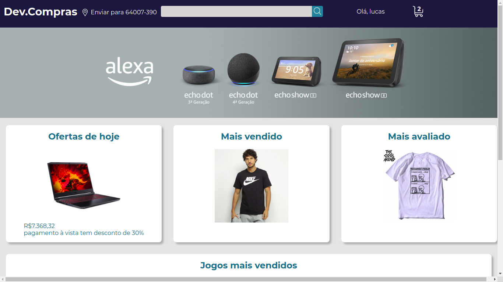

# 🛒 Dev.Compras

<p align="center">
    <a href="#-tecnologias">Tecnologias</a>&nbsp;&nbsp;&nbsp;|&nbsp;&nbsp;&nbsp;
    <a href="#-projeto">Projeto</a>&nbsp;&nbsp;&nbsp;|&nbsp;&nbsp;&nbsp;
    <a href="#-layout">Layout</a>&nbsp;&nbsp;&nbsp;|&nbsp;&nbsp;&nbsp;
    <a href="#-dowloand">Dowloand</a>&nbsp;&nbsp;&nbsp;
</p>

<!--  -->
<video width="100%" autoplay loop muted>
    <source src="./.github/dev-compras.mp4">
</video>

## 🚀 Tecnologias
Esse projeto foi desenvolvido com as seguintes tecnologias:
- HTML
- CSS
- JavaScript
- Node js
- Express
- EJS
- SQlite

## 💻 Projeto
Dev compras é uma aplicação que simula compras de produtos ,sendo possível pesquisar , visualizar e adicionar o produto no carrinho de compras.

## 🔖 Layout
No momento não está disponível.

## 📥 Dowloand
Outa opção para visualizar o projeto é baixando o projeto. Veja o passo a passo:

Baixe o projeto
```
git clone https://github.com/luccasscds/dev-compras.git
```
Instale o packajson
```
npm install packajosn.json
```
Rode o projeto
```
npm run dev
```
Entre no navegador e Digite

[localhost:3000](http://localhost:3000/)